[About](../index.html) | [Engine Swaps](swaps.html) | [Links](../links.html)
# Engine Swaps

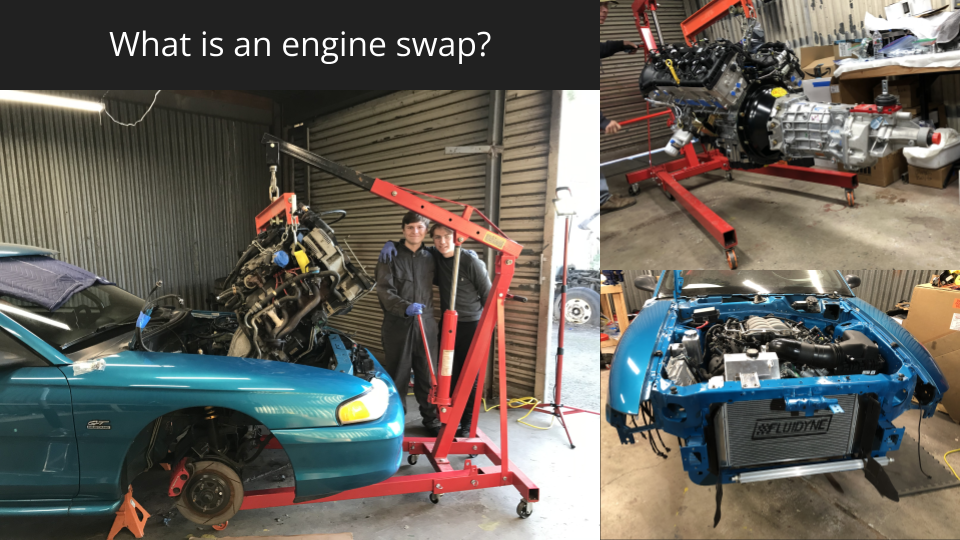
In the context of car modification, an engine swap consists of removing the engine from a car and replacing it with another. The process is very involved, with hundreds of modifications required to integrate the new engine with the existing systems in the vehicle.

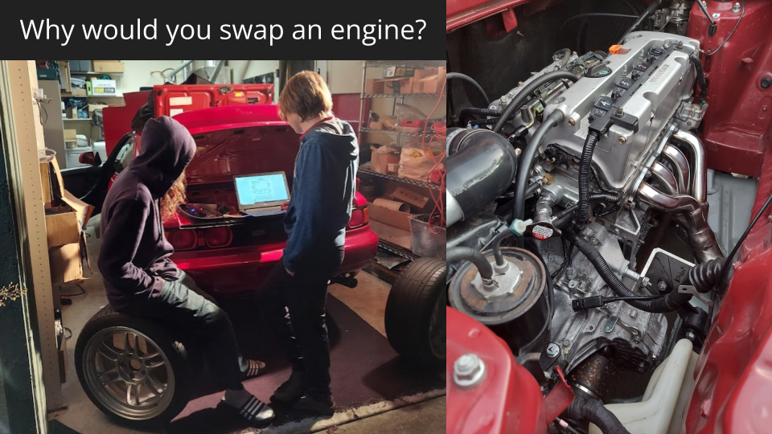
Engine swaps are most commonly undergone to increase the performance or reliability of a vehicle. Swapping in a more powerful engine will increase acceleration, and a newer engine will increase fuel efficiency and reliability. A more popular or common engine will make it easier to find better or inexpensive parts for maintenance or further modification.

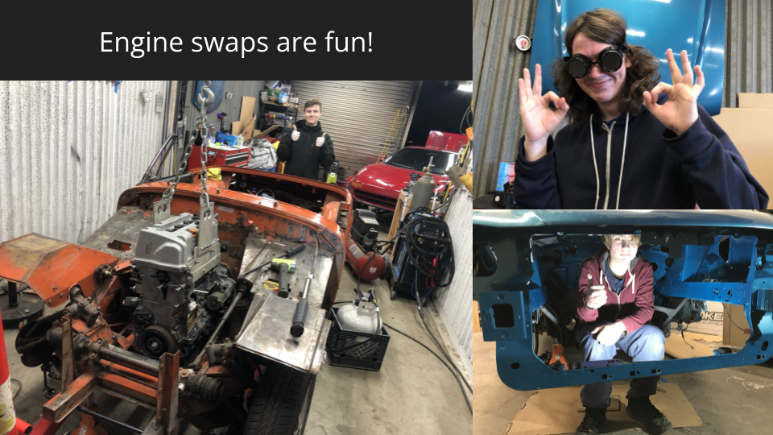
An engine swap project may take months or even years, and can be very expensive. The enjoyment lies in the challenge of the process. The project involves much learning and critical thinking, and often many failures, but it is an incredibly rewarding experience, and can be very fun, especially when done with friends.

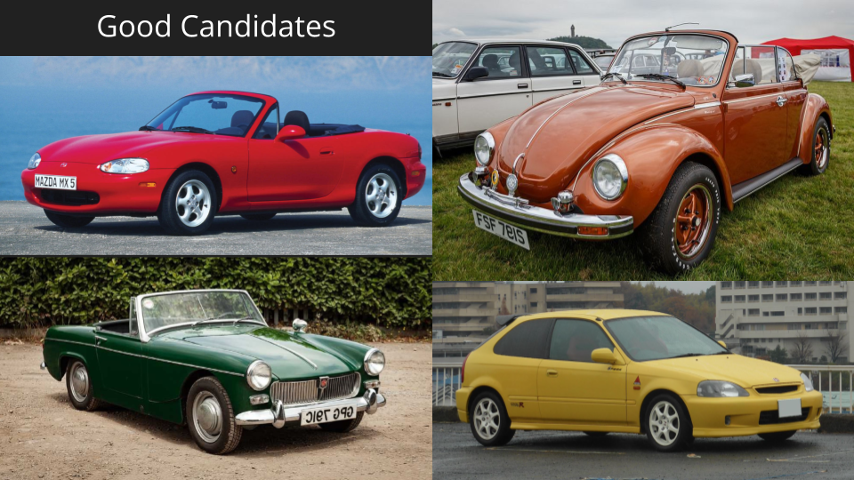
Good candidate vehicles for swaps have underpowered, difficult to modify, unreliable, or inefficient engines. Those seeking to build a high performance vehicle on a low budget often start with a cheap car and swap in a powerful engine, among other modifications.

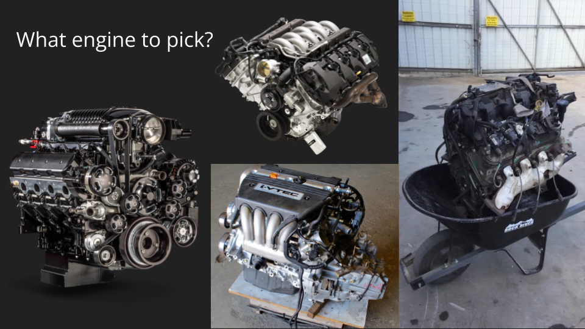
Your choice of engine is limited by physical size constraints, drive layout of the vehicle, and budget. Engines can range wildly in cost, from tens of thousands for high-performance crate engines designed for swaps, to a few hundred for junkyard engines.

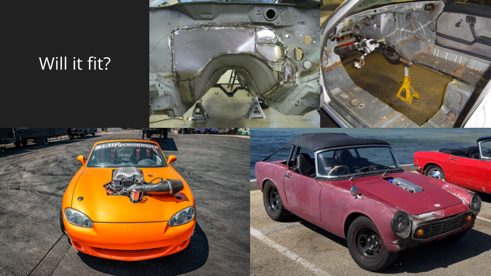
If the engine you choose does not fit into the vehicle as-is, modifications to the structure of the car may have to be done to make room for the new engine.  These modifications may be minor, or range from cutting holes in the hood to major modifications of the chassis.

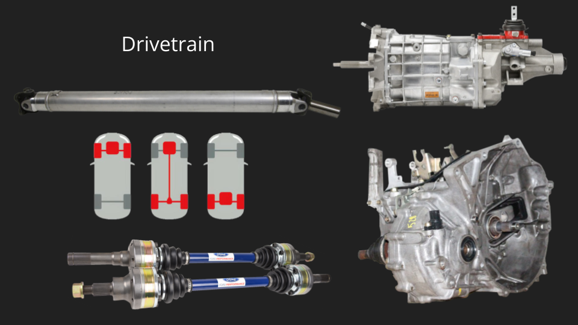
The drive layout of the engine and transmission you choose for a swap have to be compatible with that of the vehicle. If the drive layout is inline, as above, or transverse, as below, one or two shafts of custom length must be sourced to transfer power from the engine to the wheels.

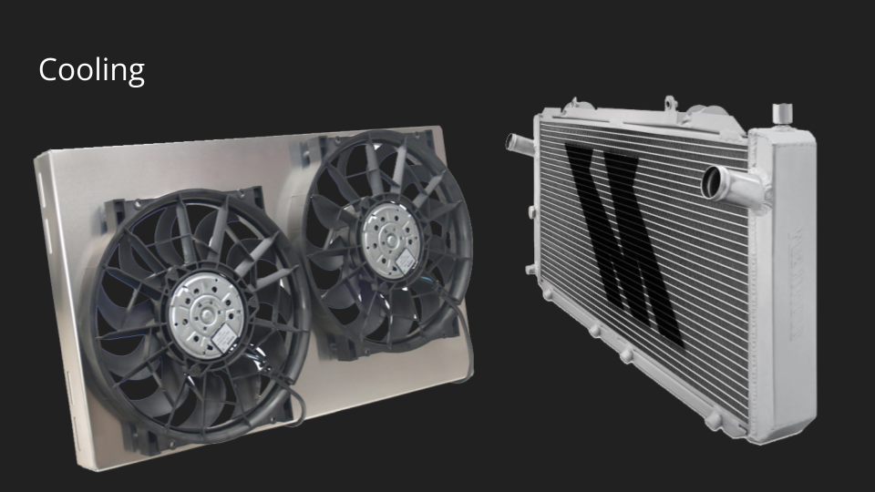
To integrate the existing cooling system with the new engine, custom hoses for inlet and outlet, as well as for interior heating must be made. An upgraded radiator and fan is often necessary to cool a more powerful or larger engine.

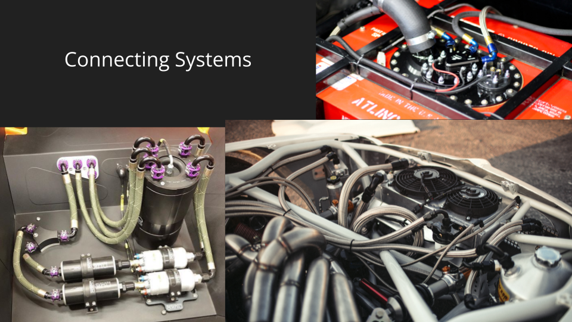
There are other various systems which must be integrated, such as fuel, vacuum, power steering, and air conditioning. These systems can vary greatly between different makes and models. Sometimes systems like power steering or air conditioning are deleted for simplicity or weight, most often in racing applications.

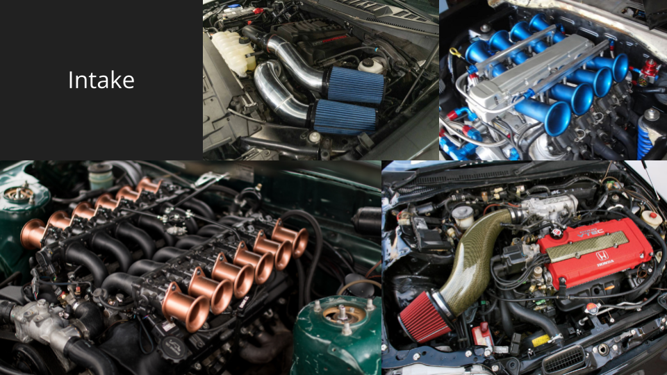
An engine needs a clean, cool, and consistent source of air to operate correctly. The intake can either be integrated into existing filters and ducting, or a new custom intake can be made.

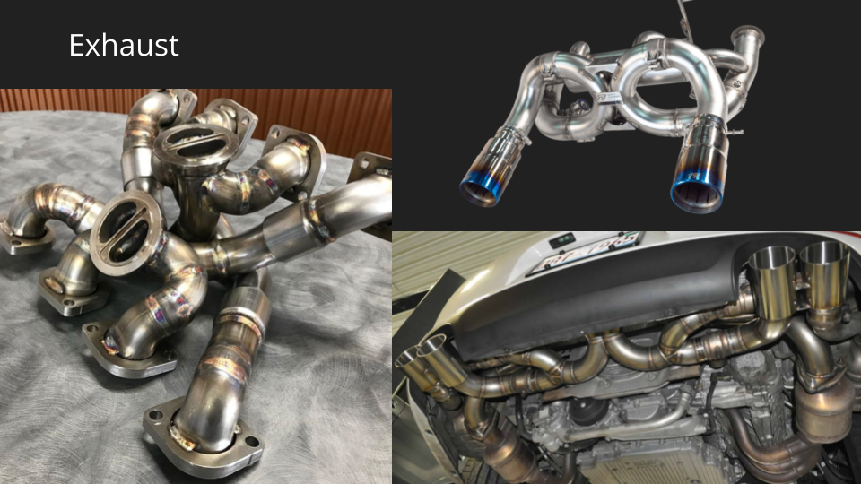
Since most engine swaps change the location of the exhaust ports on the engine, the existing exhaust piping must be modified or replaced. More powerful engines may require larger piping to accommodate the increased flow of exhaust gasses.

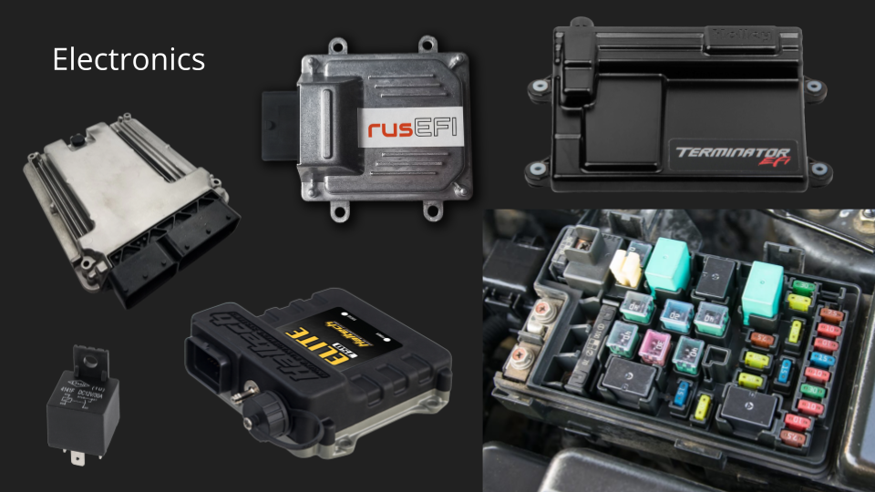
Modern engines are controlled with an electronic control unit, or ECU. There are many options available, from plug-and-play ECUs that connect to existing wiring, or universal ECUs that require new, custom wiring. Very recent vehicles may combine the ECU with interior electronics, making engine swaps very difficult.

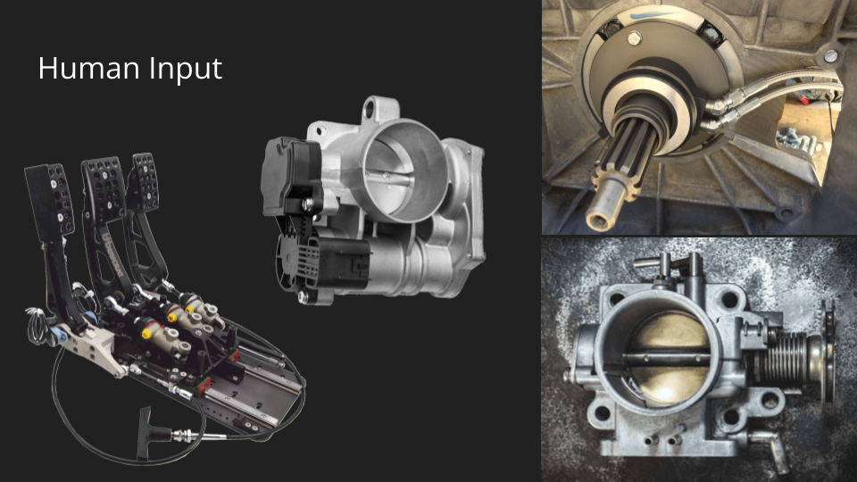
Modifications are necessary to allow the driver to control the engine and transmission. This may consist of rerouting the cable that controls the throttle, making new or extending hydraulic lines to the transmission, or converting the pedals to electronic control.

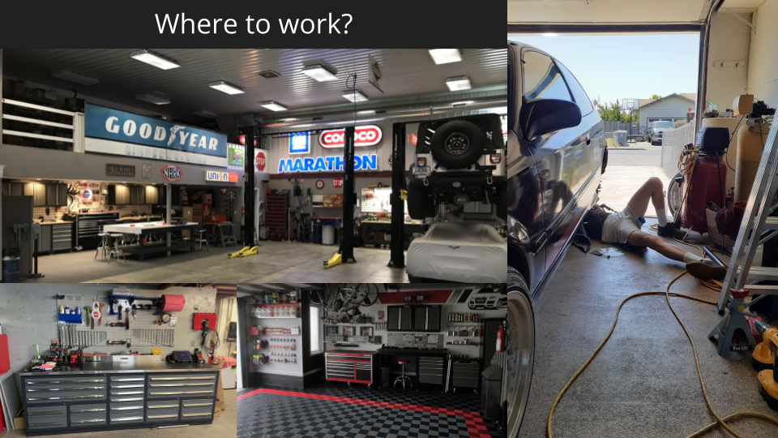
Car projects are commonly done in garages, or dedicated shop spaces if you are lucky. Organization of tools and parts is key, and can save you several hours per week. Good lighting is necessary.  A workspace must be well lit, and it’s important to have portable lights to see in difficult areas.

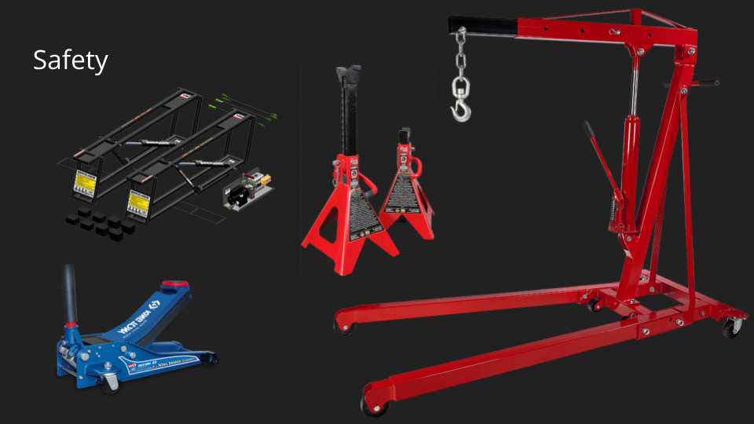
Engines are heavy, and great care must be taken when lifting them with cranes. You should also check that a vehicle is properly jacked up and stable before working around or underneath it.

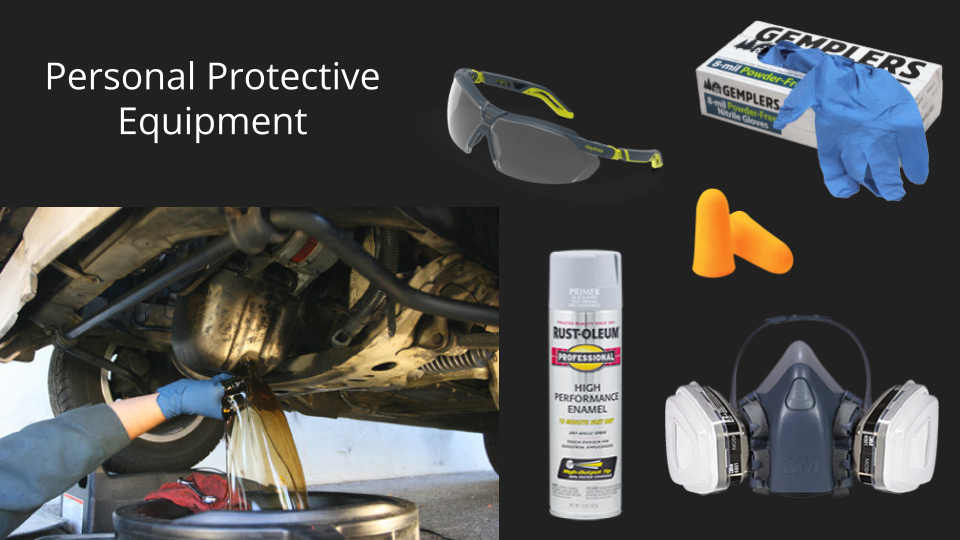
You may be exposed to hazardous materials when working on a car. Iis necessary to wear gloves and glasses to protect your skin and eyes from fluids and debris. A well ventilated area and a mask are important when using spray paint, and it’s good to have ear plugs in case of loud noises.

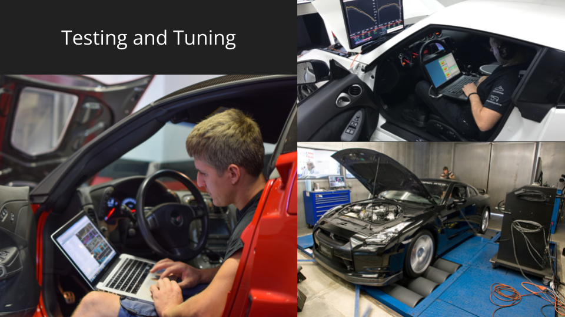
Once an engine swap has progressed sufficiently, it's time to test and check for leaks, loose bolts or electrical connections, and other issues. Once the engine can run, it must be tuned by calibrating the ECU software to get it running reliably and efficiently. It's important to be thorough to prevent problems while driving.

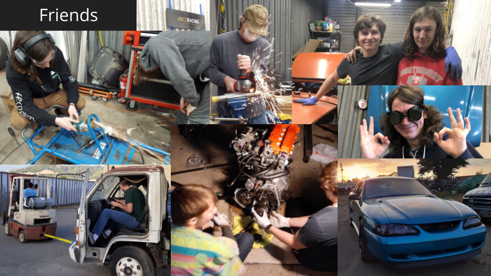
Having other people to help on a project makes the process much more enjoyable. It can also speed things up dramatically, which may be the difference between a successful and failed engine swap.

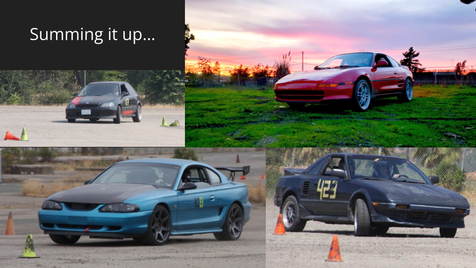
Engine swap projects can be challenging, expensive, and long, but immense satisfaction and enjoyment can be had from the process and the end result. Engine swaps are not for everyone, but are incredible experiences for those inclined. I hope you took something away from this peek into car culture.

[About](../index.html) | [Engine Swaps](swaps.html) | [Links](../links.html)
